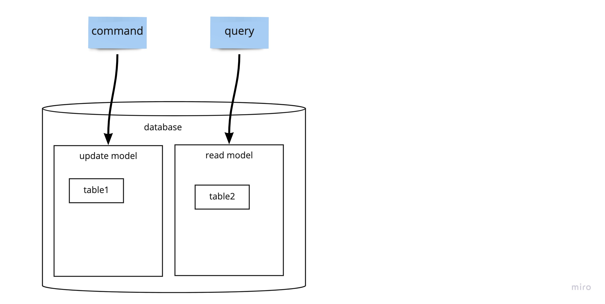
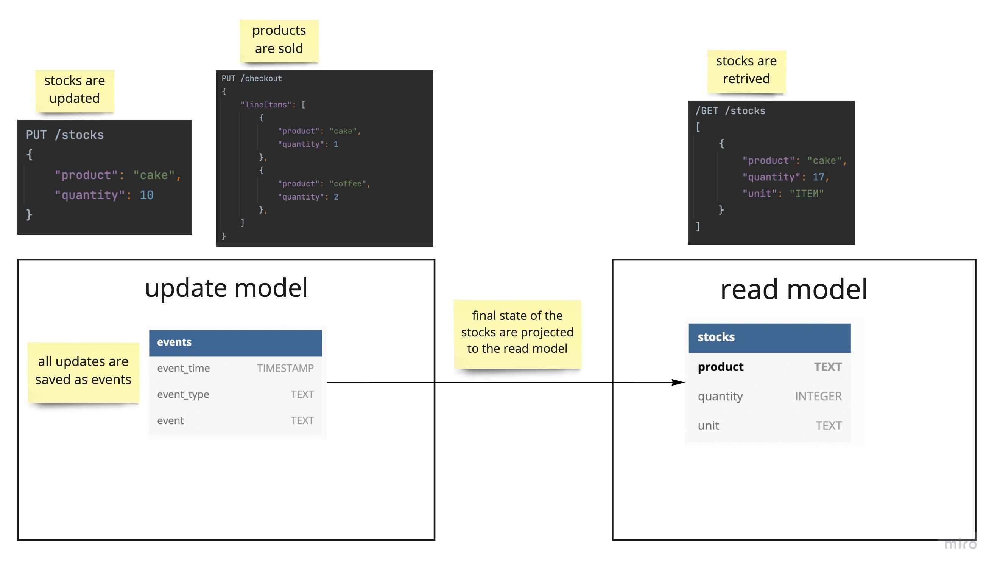
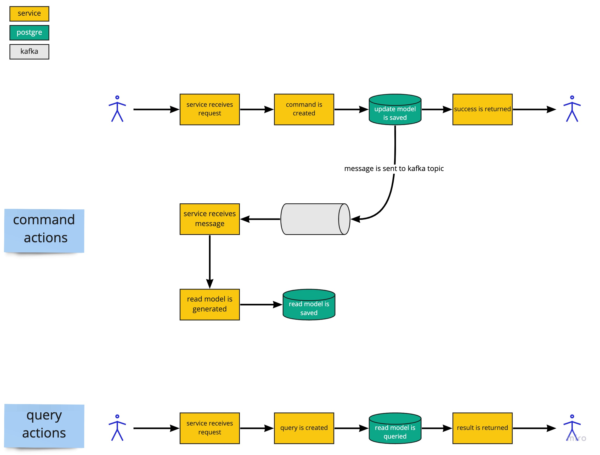

# Coffee Shop (Event Sourcing and CQRS example)

## About 

This is an example **Java** RESTful web service for a **coffee shop**.

It is designed as an **event sourcing** system where all data is stored as events.

Also read model is separated from update model by following the **Command Query Responsibility Segregation(CQRS)** pattern.

[Dropwizard](https://www.dropwizard.io) is used as the application framework.

[PostgreSQL](https://www.postgresql.org) is used as the database.

[Apache Kafka](https://kafka.apache.org/) is used for messaging.

## Event Sourcing basics

With event Sourcing, all changes to application state are stored as a sequence of events. 
 
This forms an append-only **event log**.

An entity’s current state can be created by replaying all the events in order of occurrence.

## CQRS basics

**Command:** An operation that changes the state of the application.

**Query:** An operation that reads the state of the application.

With CQRS pattern, the data for **commands** and **queries** are **split** in the database.

By splitting the commands and queries, the CQRS allows developers to use **different models to read and write data**.

## REST and Database Design

The coffee shop has to manage its stocks. 

The stocks **go up** when new products are **added** through the `PUT /stocks` endpoint.

The stocks **go down** when the products are **sold** through the `PUT /checkout` endpoint.

All updates in the stocks are saved as events in the `events` table which corresponds to the **update model**.

Then these events are projected to the `stocks` table which corresponds to the **read model**.

## Application Design

## Installation

### Build project

Run `mvn package` to build project with _Maven_.

### Start application

Run `docker-compose --profile local up` to start application with _Docker_.

To check that your application is running enter url `http://localhost:8080/`

You may see application's health at `http://localhost:8081/healthcheck`
